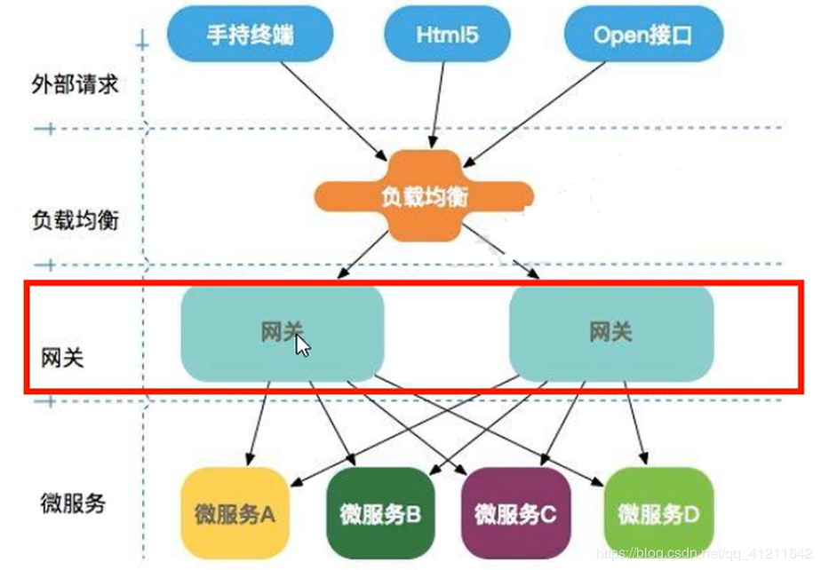

# gateway
```
Cloud 全家桶中有个很重要的组件就是网关，在1.x版本中都是采用的Zuul网关；但在2.x版本中，zuul的升级一直跳票，SpringCloud最后自己研发了一个网关替代Zuul，那就是Spring Cloud Gateway
Gateway是在Spring 生态系统之上构建的API网关服务，基于Spring 5，SpringBoot 2和Project Reactor等技术。Gateway旨在提供一种简单而有效的方式来对API进行路由，以及提供一些强大的过滤器功能，例如：熔断、限流、重试等。
```
一句话：Spring Cloud Gateway使用的是Webflux中的reactor-netty响应式编程组件，底层使用了Netty通讯框架。

## 功能：
```
-   反向代理
-   鉴权
-   流量控制
-   熔断
-   日志监控。。。
```

## 微服务架构中网关的位置



## 为什么选择Gateway
```
-   netflix不太靠谱，zuul 2.0一直跳票，迟迟不发布
-   一方面因为Zuul 1.0已经进入了维护阶段，而且Gateway是SpringCloud团队研发的，值得信赖。而且很多功能Zuul都没有用起来也非常的简单便捷。
-   Gateway是基于异步非阻塞模型上进行开发的，性能方面不需要担心。虽然Netflix早就发布了最新的Zuul 2.x，但SpringCloud貌似没有整合计划。而且Netflix相关组件都宣布进入维护期。多方面综合考虑Gateway是很理想的网关选择。
-   SpringCloud Gateway具有如下特性
-   基于Spring Framework 5，Project Reactor和Spring Boot 2.0构建
-   动态路由：能够匹配任何请求属性
-   可以对路由指定 Predicate（断言）和Filter（过滤器）
-   集成Hystrix的断路器功能
-   集成Spring Cloud 的服务发现功能
-   易于编写的Predicate（断言）和Filter（过滤器）
-   请求限流功能
-   支持路径重写
```
## SpringCloud Gateway 与 zuul 的区别
```
在SpringCloud Finchley 正式版之前，SpringCloud推荐的网关是Netflix提供的Zuul：
1、Zuul 1.x是一个基于阻塞 I/O 的API Gateway
2、Zuul 1.x基于servlet 2.5使用阻塞架构它不支持任何长连接（如websocket）Zuul的设计模式和Nginx较像，每次I/O 操作都是从工作线程中选择一个执行，请求线程被阻塞到工作线程完成，但是差别是Nginx用C++实现，Zuul用Java实现，而JVM本身会有一次加载较慢的情况，使得zuul的性能相对较差
3、Zuul 2.x理念更先进，向基于Netty非阻塞和支持长连接，但SpringCloud目前还没有整合。Zuul 2.x的性能较Zuul 1.x有较大提升。在性能方面，根据官方提供的基准测试，SpringCloud Gateway的RPS（每秒请求数）是Zuul的1.6倍
4、SpringCloud Gateway建立在Spring Framework5、Project Reactor和Spring Boot 2之上，使用非阻塞API
5、SpringCloud Gateway还支持WebSocket，并且与Spring紧密集成用于更好的开发体验
```
### zuul 1.x模型
```
SpringCloud中所集成的Zuul版本，采用的是Tomcat容器，使用的是传统的Servlet IO处理模型。
```
## Servlet生命周期？
```
servlet 由 servlet container 进行生命周期管理
container 启动时构造 servlet 对象并调用 servlet init() 进行初始化；
container 运行时接受请求，并为每个请求分配一个线程（一般从线程池中获取空闲线程）然后调用service()；
container 关闭时调用 servlet destory() 销毁servlet；
```
### 上述模式的缺点：
```
servlet是一个简单的网络IO模型，当请求进入servlet container时，servlet container就会为其绑定一个线程，在并发不高的场景下这种模型是适用的。但是一旦高并发（比如用jmeter压测），线程数量就会涨，而线程资源代价是昂贵的（上下文切换，内存消耗大）严重影响请求的处理时间。在一些简单业务场景下，不希望为每个request分配一个线程，只需要1个或几个线程就能应对极大并发的请求，这种业务场景下servlet模型没有优势
所以Zuul 1.x是基于servlet之上的一个阻塞式处理模型，即spring实现了处理所有request请求的一个servlet（DispatcherServlet）并由该servlet阻塞式处理。所以SpringCloud Zuul无法摆脱servlet模型的弊端。
```

## Gateway模型
```
Gateway支持 Reactor 和 WebFlux

传统的Web框架，比如说：struts2，springmvc等都是基于Servlet API与servlet容器基础之上运行的。
但是Servlet3.1之后有了异步非阻塞的支持，而WebFlux是一个典型非阻塞异步的框架，它的核心是基于Reactor的相关API实现的。相对与传统的Web框架来说，它可以运行在诸如Netty，Undertow及支持Servlet3.1的容器上。非阻塞式+函数式编程

Spring WebFlux 是 Spring 5.0引入的新的响应式框架，区别于Spring MVC，它不需要依赖Servlet API，它是完全异步非阻塞的，并且基于 Reactor 来实现响应式流规范
```       

## Gateway 核心概念及工作流程

### 核心概念：
```
Route(路由)：路由是构建网关的基本模块，它由ID、目标URI，一系列的断言和过滤器组成，如果断言为true则匹配该路由

Predicate(断言)：参考的是Java8的java.util.function.Predicate
开发人员可以匹配HTTP请求中的所有内容(例如请求头或请求参数)，如果请求与断言相匹配则进行路由

Filter(过滤)：指的是Spring框架中GatewayFilyter的实例，使用过滤器，可以在请求被路由前或者之后进行修改

匹配方式就叫断言，实现这个匹配方式就叫filter，对外表现出来就是路由的功能。
```    
```
web 请求，通过一些匹配条件，定位到真正的服务节点。并在这个转发过程的前后，进行一些精细化控制。
predicate 就是我们的匹配条件，而filter，就可以理解为一个无所不能的拦截器。有了这两个元素再加上目标uri，就可以实现一个具体的路由。
```      

### Gateway 工作流程
```
客户端向Spring Cloud Gateway发出请求。然后在Gateway Handler Mapping中找到与请求相匹配的路由，将其发送到Gateway Web Handler。

Handler再通过指定的过滤器链来讲请求发送到我们实际的服务执行业务逻辑，然后返回。
过滤器之间用虚线分开是因为过滤器可能会在发送代理请求之前（“pre”）或之后（“post”）执行业务逻辑

Filter 在 “pre” 类型的过滤器可以做参数校验、权限校验、流量监控、日志输出、协议转换等；在 “post” 类型的过滤器中可以做响应内容、响应头的修改，日志的输出，流量监控等，有着非常重要的作用
```
**核心逻辑 ：路由转发 + 执行过滤器链**